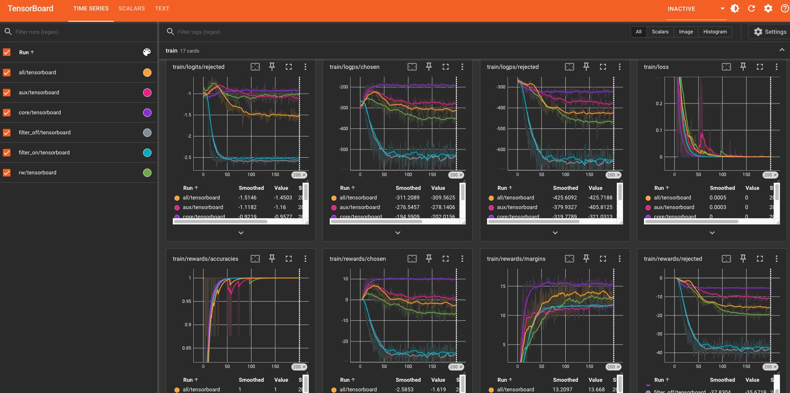

# Training pipeline

Run all commands from the repository root. These instructions assume a single
node with at least three visible GPUs. Complete each stage before starting the next.

## 1. Blind rollout

```bash
# shard with 13 nodes, each node has 3 gpu
BLIND_ONESHOT_EPISODES=120 ./data/blind-rollout/shard13.sh 13
./data/blind-rollout/shard13.sh merge
```
Output: `data/blind-rollout/result/a_beta_{core,aux,all,rw,filter_off,filter_on}.jsonl`

## 2. A+beta pairs

`algorithm1.py` transcribes paper Algorithm 1: per episode, for each round pin
the action to the solver best response, keep the flip only if the counterfactual
horizon filter certifies it, paraphrase leak-free reasoning, emit the DPO pair.
`algorithm1.sh` is the launcher: conda/CUDA setup + the 13-node x 3-GPU sharding
(one resumable worker per GPU, 39 total), like `shard13.sh`.

```bash
# shard with 13 nodes, each node has 3 gpu
./data/alpha-beta/algorithm1.sh 1  # ... node 2 .. 13
./data/alpha-beta/algorithm1.sh merge
```

Output: `data/alpha-beta/result/a_beta_{core,aux,all,rw}.jsonl`

## 3. Hypothesis B pairs

```bash
CUDA_VISIBLE_DEVICES=0,1,2 HB_VARIANTS=filter_on,filter_off HB_RESULT_DIR=data/b-hypothesis/result ./data/b-hypothesis/hypothesis_b.sh
```

Output: `data/b-hypothesis/result/b_filter_{on,off}.jsonl`

## 4. DPO training

```bash
RUN_ID=paper DATA_DIR=data/alpha-beta/result TRAIN_VARIANTS=core,aux,all,rw TRAIN_NUM_GPUS=3 TRAIN_AUTO_MERGE=false ./train/dpo-lora/train.sh
RUN_ID=paper DATA_DIR=data/b-hypothesis/result TRAIN_VARIANTS=filter_on,filter_off TRAIN_NUM_GPUS=3 TRAIN_AUTO_MERGE=false ./train/dpo-lora/train.sh
```

* GPU 0 trains `core` followed by `rw`, GPU 1 trains `aux`, and GPU 2 trains `all`.
Output: `runs/paper/lora/{core,aux,all,rw,filter_off,filter_on}`


# Artifact
## Tensorboard 


## Hugging Face - Best eval checkpoint step
https://huggingface.co/Bianca2/trace/tree/main